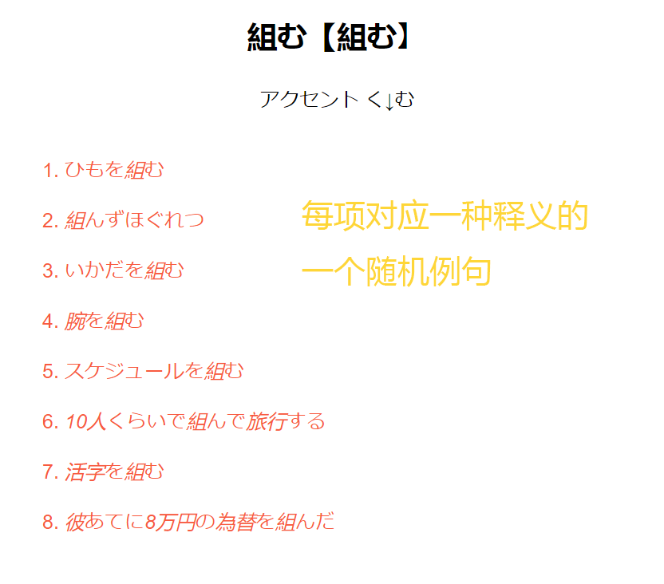
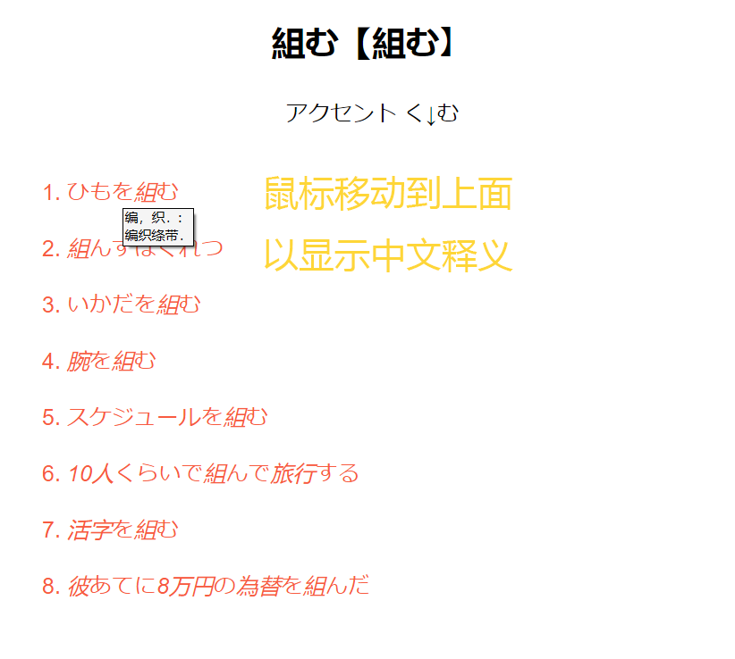
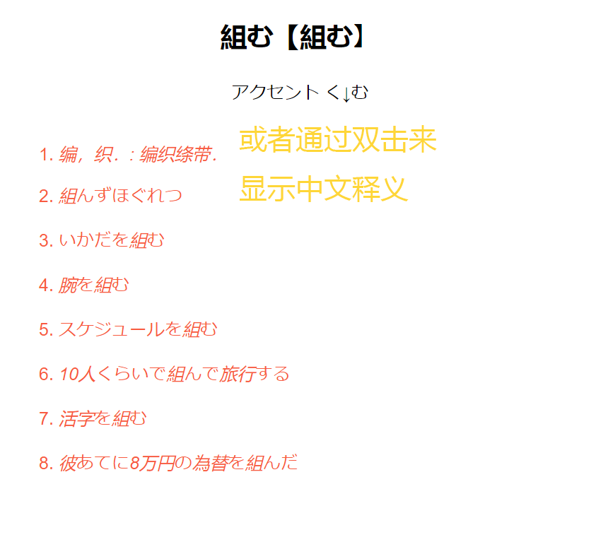
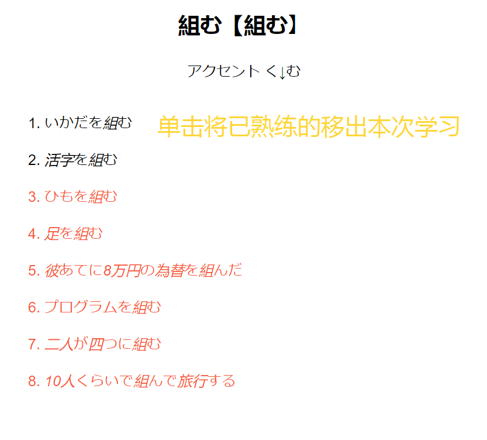
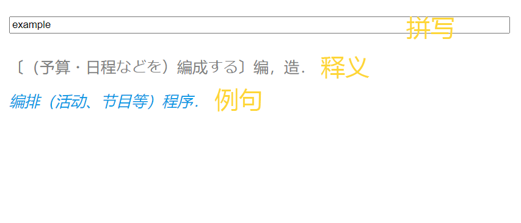

# AnkiJaEn
强化Anki下的英语和日语学习场景

# 功能

1. 通过*随机例句*学习“英语/日语 -> 中文”与“中文 -> 英语/日语”
2. 不仅学习一个词的多种释义，也会掺入学习各种用法(习语、动词短语、书面/口语等)
3. 对于一个单词所已熟练的释义/用法，可点击句子取消高亮，该释义/用法不会在本次学习的后续中出现

# 使用

1. 下载.apkg文件（日语为JEV.apkg，英语为COCA.apkg)
2. 运行Anki(版本>2.1.50)
3. 选择文件-导入，选择刚下载的apkg文件
4. 开始学习
5. （可选）（推荐）用[fsrs4anki](https://github.com/open-spaced-repetition/fsrs4anki)此插件来优化复习间隔

# 预览

## 英语/日语 -> 中文

___

___

___

___

___

## 中文 -> 英语/日语

# 可配置项

#### 字太小/太大

1. Anki首页，点击“牌组”
2. 点击所要改变字体大小的牌组名称
3. 点击“浏览”
4. 点击右侧的"卡片..."按钮
5. 点击左侧的“样式”按钮
6. 找到`.root { `
7. 把`transform: scale(0.8)`中的`0.8`改成想要的缩放率(例. 放大1.5倍则改成1.5)
8. 点击右下的保存

#### 过滤掉不想学习的用法(英式、美式、澳式、口语、书面、幽默、旧用法等)(目前只支持英语牌组)

（默认显示美式、口语、书面、旧用法、幽默，不显示英式、澳式、南非式、北英式、印式、专用语）

1. Anki首页，点击“牌组”
2. 点击英语牌组
3. 点击“浏览”
4. 点击右侧的"卡片..."按钮
5. 点击"卡片模板: "的下拉框，选择第一个
6. 点击"正面内容模板"
7. 找到`var labelsNeedOrNot = {`
8. 把想要的改成true, 不想要的改成false。（例: 启用英式则把`BrE: false,`改成`BrE: true,`；禁用美式则把`AmE: true,`
   改为`ArE: false,`；注意有无`,`
9. 点击保存

# Acknowledgement
日本語教育語彙表
中日・日中辞典（第3版）  
小学馆-日中辞典第三版.mdx @okayer  
COCA(Corpus of Contemporary American English)  
牛津高阶英汉双解词典  
牛津高阶英汉双解词典(第9版)_V3.1.2版.mdx @Origin by Robot athenawang29@gmail.com @v3.1.2 by A*ure  
[fastwordquery](https://github.com/sth2018/FastWordQuery)