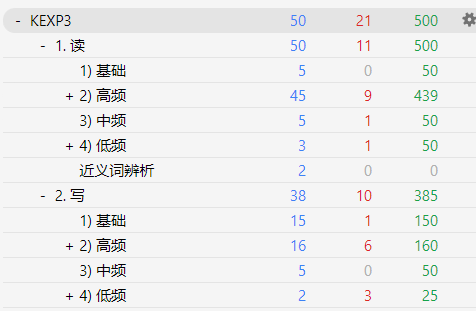
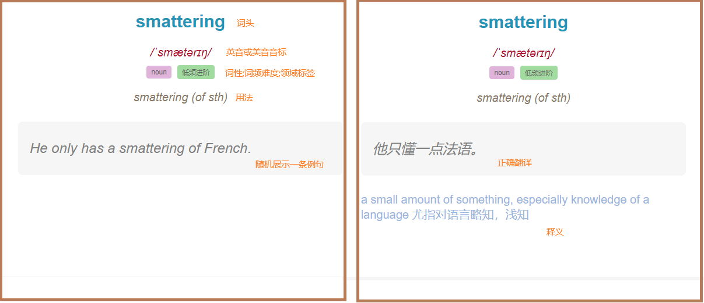
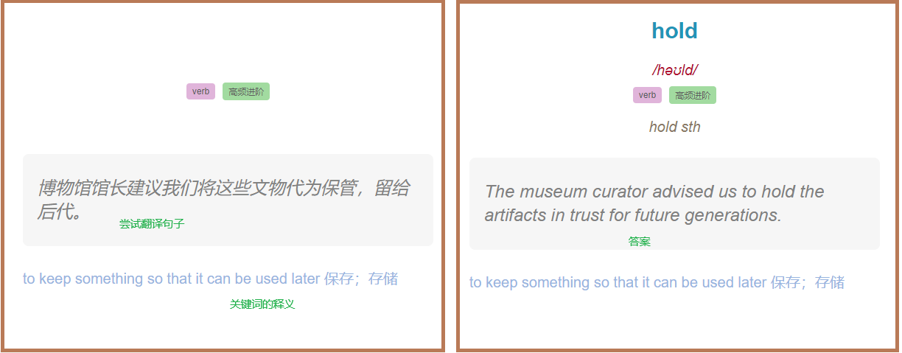

## AnkiEnJa
面向外语学习的语境牌组（英语、日语），运用了一些较前沿的学习理念与实践，助力高效学外语🚀🚀  

### 亮点
1. **原子化**。针对"一个词可能有多种释义、词组、习语"，将其全部拆成独立卡片。*一卡一释义*，减少学习负担。
2. **单例句**。每次学习展示*随机例句*。对填鸭学习说不，配合语境理解单词。
3. **实用性强**。覆盖所有常见*词频表*，包括4000基础词、高中、四级、六级、COCA20000、柯林斯2-5星、牛津5000、雅思8000、朗文9000、麦克米伦7500。
4. **效率超高**。对不同的学习维度（读、写、听）、不同的词义频率和难度，分配独立的针对每个人自身的自适应记忆模型，最大化学习效率。

### 展示
#### 分级

#### "阅读理解"卡片

---

#### "写作"卡片

---

### 使用方法
1. 下载最新版anki
   - [Windows/Mac/Linux](https://github.com/ankitects/anki/releases/latest)
   - [Android](https://github.com/ankidroid/Anki-Android/releases/latest)
2. 下载牌组
   - [英语牌组](https://ankiweb.net/shared/info/2037155287) 
   - [日语牌组](https://ankiweb.net/shared/info/283976325)
3. 启动anki，导入牌组
   - pc端点击：左上角 - 文件 - 导入牌组
   - 安卓端点击：右上角 - ⋮ - 导入牌组

### 未来计划
1. 加入AI例句配音，单独训练"听"
2. 进阶使用教程

#### 问题反馈
提issue  
#### 讨论交流

### 请支持正版
本牌组完全免费，仅供个人学习交流使用，禁止一切商业用途。  
  
如果你觉得好用，请支持👇以下正版辞典。

### 鸣谢 - 辞典
**日本語教育語彙表**  
**新世纪日汉双解大辞典** - 外语教学与研究出版社  
**大辞泉** - 小学館  
**JLPT文法解説まとめ** - 日本語NET  
**日语常用惯用句分类学习辞典** - 上海外语教育出版社  
**広辞苑-第七版** - 岩波書店  
**日中辞典**〔第3版〕 - 小学館  

**牛津高阶英汉双解词典** - 商务印书馆 

### 鸣谢
牛津高阶英汉双解辞典(第10版).mdx @leon046-@DDD  
牛津高阶英汉双解词典(第9版)_V3.1.2版.mdx @Origin by Robot athenawang29@gmail.com @v3.1.2 by A*ure  
新世纪日汉双解大辞典.mdx @freecomic101 @蜻蜓点水等  
小学馆-日中辞典第三版.mdx @okayer  
大辞泉.mdx @MeigenChou  
日语常用惯用句分类学习辞典.epub @  
広辞苑 第七版.mdx @epistularum  
JLPT文法解説まとめ.mdx @epistularum  
