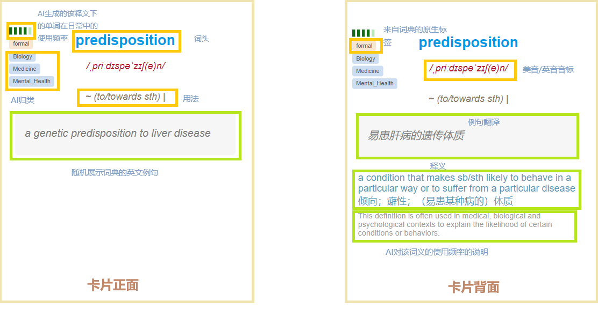
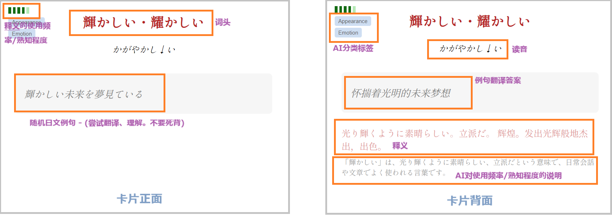
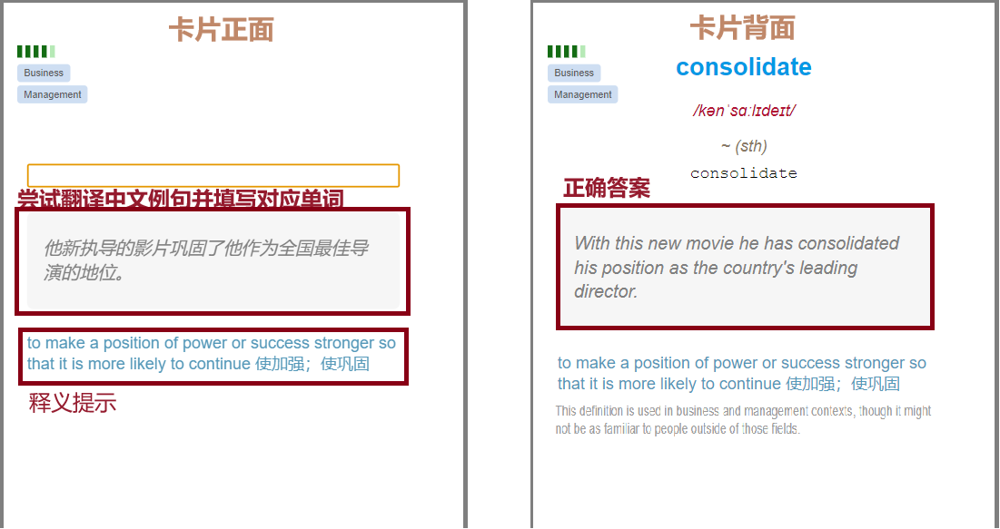
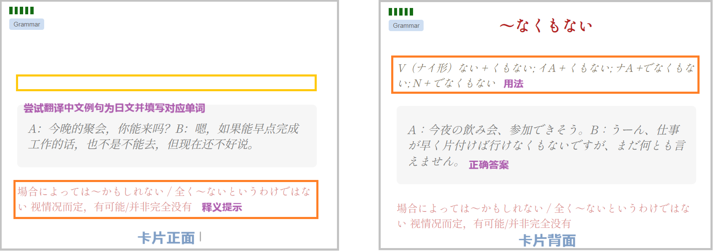

# AnkiEnJa
4202年，可能你只需要这么一款免费app来提升英语日语水平🚀🚀  
  
综合市面上背词软件绝大部分优势：
1. 词文串学。通过语境学习单词
2. 个人专属的记忆曲线
3. 自定义学习计划
4. 双向学习。外语 -> 中文， 中文->外语
5. 可视化学习统计数据
6. 过滤不想学的词
7. 词根词缀

另有新特色👇
# 亮点
1. 全面**原子化**。针对"一个词可能有多种释义、词组、习语"，将其全部拆成独立卡片。**一卡一释义**，最大化学习效率。
2. 每次学习展示**随机例句**。对填鸭学习说不，配合语境理解单词。
3. 通过AI生成基于**词义**的使用频率，词频介绍。
4. 超高**可定制化**，只学习感兴趣的领域和高低频词。
5. 将"阅读理解"和"写作"拆分成**独立记忆活动**。给不同的学习活动分配特有的记忆参数，进一步优化学习效率。
6. **权威辞典**，权威中英释义。
7. 权威词频表**COCA 20000**，高考、考研、出国通通不在话下。
8. TODO. 自定义**配音包**。跟机械感说拜拜，只听喜欢的音色。

# 展示
### "阅读理解"卡片

---

### "写作"卡片

---

# 下载地址
英语: https://ankiweb.net/shared/info/1018349790  
日语: https://ankiweb.net/shared/info/283976325

# 未来计划
1. 加入AI例句配音，单独训练"听"，培养"语感"

# 进阶用法
### 将其他牌组的学习记录迁移过来
https://ankiweb.net/shared/info/1249258442

### 根据tag批量暂停不想学习的卡片
https://ankiweb.net/shared/info/342205704

## 请支持正版
本牌组完全免费，仅供个人学习交流使用，禁止一切商业用途。  
  
如果你觉得好用，请支持👇以下正版辞典。

# 鸣谢 - 辞典/词频
**日本語教育語彙表**  
**新世纪日汉双解大辞典** - 外语教学与研究出版社  
**大辞泉** - 小学館  
**JLPT文法解説まとめ** - 日本語NET  
**日语常用惯用句分类学习辞典** - 上海外语教育出版社  
**広辞苑-第七版** - 岩波書店  
**日中辞典**〔第3版〕 - 小学館  

**COCA**(Corpus of Contemporary American English)  
**牛津高阶英汉双解词典** - 商务印书馆 

## 鸣谢
牛津高阶英汉双解辞典(第10版).mdx @DDD  
牛津高阶英汉双解词典(第9版)_V3.1.2版.mdx @Origin by Robot athenawang29@gmail.com @v3.1.2 by A*ure
新世纪日汉双解大辞典.mdx @freecomic101 @蜻蜓点水等
小学馆-日中辞典第三版.mdx @okayer
大辞泉.mdx @MeigenChou
日语常用惯用句分类学习辞典.epub @  
広辞苑 第七版.mdx @epistularum  
JLPT文法解説まとめ.mdx @epistularum  

[fastwordquery](https://github.com/sth2018/FastWordQuery)  
Google Gemini